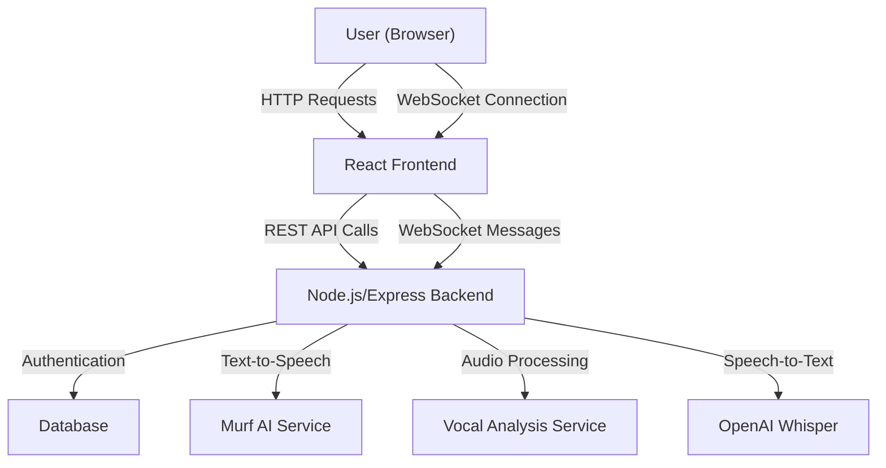

# InterviewIO

A next-generation AI-powered mock interview platform that delivers realistic, interactive interview experiences with real-time vocal feedback and personalized question generation based on your role.


*Mock interview session with real-time feedback*

## 🚀 Project Overview

**InterviewIO** is a sophisticated mock interview platform built with a modern MERN-like stack (React + Node.js). It simulates real interview scenarios using AI-driven interactions, real-time voice analysis, and personalized question generation. The platform is designed for job seekers, students, and professionals to practice and improve their interview skills in a realistic, supportive environment.

## ✨ Key Features

### 🎯 Core Features
- **Role-Based Selection**: Choose from various job roles to receive tailored interview questions
- **Real-time Voice Interaction**: AI interviewer speaks using Murf AI's realistic voice synthesis
- **Real-Time Vocal Analysis**: Instant feedback on pace, filler words, and clarity as you speak
- **Comprehensive Session Analysis**: Detailed feedback report with actionable recommendations
- **User Authentication**: Secure login and registration system

### 🎨 UI/UX Features
- **Responsive Design**: Optimized for both desktop and mobile devices
- **Modern Interface**: Clean, intuitive user interface with custom CSS
- **Dashboard**: Central hub to start interviews and track your progress
- **Real-time Feedback**: Live feedback display during your responses

## 🛠️ Tech Stack

### Frontend
- **React** - Component-based UI library
- **Context API** - State management
- **Custom CSS** - Styling and responsive design
- **WebSocket Client** - Real-time communication

### Backend
- **Node.js** - Runtime environment
- **Express.js** - Web framework
- **WebSocket** - Real-time bidirectional communication
- **JWT** - Authentication tokens

### AI/ML & Services
- **Murf AI** - Realistic voice synthesis for interviewer
- **Custom Vocal Analysis** - Real-time audio processing for feedback
- **OpenAI Whisper** - Speech-to-text transcription

## 📁 Project Structure

```
InterviewIO/
├── InterviewIO-Backend/         # Backend (Node.js/Express)
│   ├── controllers/
│   │   └── InterviewController.js
│   ├── models/
│   │   └── User.js
│   ├── routes/
│   │   ├── authRoutes.js
│   │   └── realtime.js
│   ├── services/
│   │   ├── murfService.js
│   │   ├── vocalAnalysisService.js
│   │   └── voiceService.js
│   ├── uploads/
│   ├── env
│   ├── index.js                 # Main server entry point
│   ├── package.json
│   └── WebSocketServer.js
│
└── interviewio-frontend/        # Frontend (React)
    ├── public/
    │   ├── index.html
    │   ├── favicon.ico
    │   └── manifest.json
    └── src/
        ├── components/
        │   ├── Auth/
        │   │   ├── Login.js
        │   │   ├── Register.js
        │   │   └── Auth.css
        │   ├── Common/
        │   │   ├── Header.js
        │   │   └── Header.css
        │   └── Dashboard/
        │       ├── RoleSelection.js
        │       ├── Interview.js
        │       ├── Interview.css
        │       ├── RealTimeFeedback.js
        │       ├── RealTimeFeedback.css
        │       ├── Results.js
        │       └── Results.css
        ├── context/
        │   └── AuthContext.js
        ├── App.js
        ├── App.css
        └── index.js
```

## 🏗️ Architecture



## ⚙️ Installation & Setup

### Prerequisites
- Node.js (v16 or higher)
- npm or yarn
- Murf AI API Key
- OpenAI API Key (for Whisper transcription)

### Step-by-Step Setup

1. **Clone the repository**
   ```bash
   git clone https://github.com/yourusername/InterviewIO.git
   cd InterviewIO
   ```

2. **Backend Setup**
   ```bash
   cd InterviewIO-Backend
   mkdir uploads
   npm install
   ```

3. **Frontend Setup**
   ```bash
   cd ../interviewio-frontend
   npm install
   ```

4. **Environment Configuration**
   
   Create a `.env` file in the `InterviewIO-Backend` directory:
   ```env
   # Server Configuration
   MONGODB_URI=your_mongodb_url
   PORT=5100
   MURF_API_KEY=your_murf_api_key_here
   OPENAI_API_KEY=your_openai_api_key_here
   JWT_SECRET=your_secure_jwt_secret_here
   ```

5. **Start the Development Servers**

   Terminal 1 - Backend:
   ```bash
   cd InterviewIO-Backend
   node index.js
   ```
   
   Terminal 2 - Frontend:
   ```bash
   cd interviewio-frontend
   npm start
   ```

6. **Access the Application**
   - Open your browser and navigate to `http://localhost:3000`
   - Register a new account and login
   - Select a job role and begin your mock interview!

## 🎮 How to Use InterviewIO

1. **Registration/Login**: Create an account and sign in
2. **Role Selection**: Choose your target job role from available options
3. **Interview Setup**: Configure your microphone permission
4. **Practice Session**: 
   - Listen to questions from the AI interviewer
   - Record your responses
   - Receive real-time feedback on your delivery
5. **Review Results**: Analyze your performance with detailed feedback reports

## 🚀 API Endpoints

### Authentication Routes
| Method | Endpoint | Description |
|--------|----------|-------------|
| POST | `/api/auth/register` | Register a new user |
| POST | `/api/auth/login` | Authenticate user |
| GET | `/api/auth/me` | Get current user profile |

### WebSocket Events
- `connection` - Establish real-time connection
- `audio_chunk` - Stream audio data for analysis
- `feedback` - Receive real-time vocal feedback
- `transcript` - Receive speech-to-text results

## 🤝 Contributing

We love contributions! Here's how you can help improve InterviewIO:

### Development Process

1. **Fork the Repository**
   ```bash
   git clone https://github.com/yourusername/InterviewIO.git
   cd InterviewIO
   ```

2. **Create a Feature Branch**
   ```bash
   git checkout -b feature/amazing-feature
   ```

3. **Make Your Changes**
   - Follow the existing code style
   - Add comments for complex logic
   - Update documentation as needed

4. **Commit Your Changes**
   ```bash
   git commit -m 'Add amazing feature'
   ```

5. **Push to Your Branch**
   ```bash
   git push origin feature/amazing-feature
   ```

6. **Open a Pull Request**
   - Describe your changes in detail
   - Reference any related issues
   - Include screenshots for UI changes

### Coding Standards

- Use meaningful variable and function names
- Comment complex algorithms and business logic
- Follow the existing code style and structure
- Ensure responsive design for frontend components

## 🐛 Troubleshooting

### Common Issues

1. **Microphone Access**
   - Ensure your browser has microphone permissions
   - Check if other applications are using the microphone

2. **Audio Processing Errors**
   - Verify your Murf AI API key is valid
   - Check network connectivity

3. **Authentication Issues**
   - Clear browser cookies and localStorage
   - Verify JWT secret in environment variables

4. **WebSocket Connection Problems**
   - Check if the backend server is running
   - Verify CORS settings

### Getting Help

If you encounter issues not covered here:
1. Check the existing [GitHub Issues](https://github.com/Het4304/InterviewIQ/issues)
2. Create a new issue with detailed description
3. Include error messages and screenshots if possible

## 📄 License

This project is licensed under the MIT License - see the [LICENSE](LICENSE) file for details.

##  Acknowledgments

- **Murf AI** for providing high-quality voice synthesis API
- **OpenAI** for Whisper speech-to-text capabilities
- The React and Node.js communities for excellent documentation and tools
- All contributors who have helped shape InterviewIO

## 📞 Support

If you have questions or need help:
- Create an issue on our [GitHub repository](https://github.com/Het4304/InterviewIQ/issues)
---

<div align="center">
  
Made with ❤️ by the InterviewIQ Team

<!-- [](https://github.com/yourusername/InterviewIO/stargazers)
[](https://github.com/yourusername/InterviewIO/network/members) -->

</div>